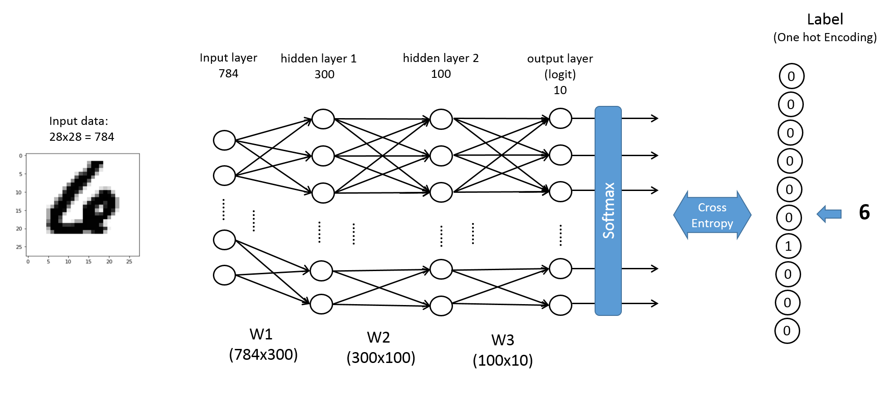

## Program description

- DNN for digit classification
- It is implementation of Deep Neural Network (DNN) in Tensorflow based on a gpu device.
- Examples were produced using MNIST dataset. 
- Author of original program
[Seokmin Oh, PhD candidate, July, 2019]

## Library version
- Python 3.6.8
- Tensorflow 1.13.1
- Numpy 1.16.4

## Training
```bash
./train.py --help
or python train.py --help
```

```
optional arguments:
  -h, --help            show this help message and exit
  -nh1 N_HIDDEN1, --n_hidden1 N_HIDDEN1
                        number of neurons (hidden1) (default: 300)
  -nh2 N_HIDDEN2, --n_hidden2 N_HIDDEN2
                        number of neurons (hidden2) (default: 100)
  -ep EPOCHS, --epochs EPOCHS
                        num epochs (default: 10)
  -bs BATCH_SIZE, --batch-size BATCH_SIZE
                        batch size (default: 64)
  -dr DROPOUT_RATE, --dropout_rate DROPOUT_RATE
                        dropout rate (default: 0.5)
  -lr LEARNING_RATE, --learning-rate LEARNING_RATE
                        learning rate (default: 0.001)
  -tr TRAINING_RATIO, --training_ratio TRAINING_RATIO
                        training_ratio (default: 0.9)
  -log LOG_DIR, --log_dir LOG_DIR
                        log directory to save (default: logs)
  -level {debug,info,warning,error}, --log_level {debug,info,warning,error}
                        (default: debug)
```

Train:
```bash
./train.py
or python train.py
or run.sh
```

## Evaluating
```bash
./evaluate.py --help
or python evaluate.py --help
```

```
optional arguments:
  -h, --help            show this help message and exit
  -ckpt CHECKPOINT, --checkpoint CHECKPOINT
                        .ckpt file to load checkpoint from (required)
  -bs BATCH_SIZE, --batch-size BATCH_SIZE
                        batch size for feed forwarding (default: 1)
  -out OUTPUT_DIR, --output_dir OUTPUT_DIR
                        log directory to save (default: outputs)
  -level {debug,info,warning,error}, --log_level {debug,info,warning,error}
                        (default: debug)
```

Evaluate:
```bash
./evaluate.py -ckpt "./runs/2019_07_30_11_04_00/checkpoints/model-9"
or python evaluate.py -ckpt "./runs/2019_07_30_11_04_00/checkpoints/model-9"
or test.sh
```

Replace the checkpoint dir with the output from the training. To use your own data, change the `evaluation.py` script to load your data.


## References
- [Deep learning (LeCun et al., 2015)](https://www.nature.com/articles/nature14539)
- [Deep learning (Goodfellow et al., 2016)](https://www.deeplearningbook.org/)
